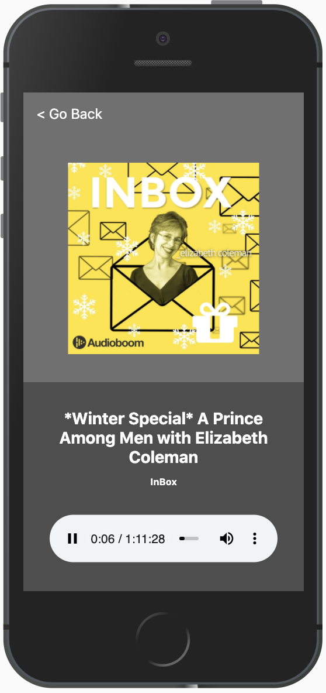

# Podcast App (NextJS / TS / SSR)
Podcast App that built in NextJS that consumes the AudioBoom API.



## Tree
```
├── components
│   ├── ChannelGrid
│   ├── Layout
│   ├── PodcastList
│   ├── PodcastListWithClick
│   └── PodcastPlayer
└── pages
```

## Setup in local

* `npm install` or `yarn` to install dependencies
* `npm run dev` or `yarn dev` to run development
* `npm run build && npm start` or `yarn run build && yarn run start` for production

Note: The project also has eslint, prettier and husky configured.

Eslint: `yarn lint`

Prettier: `yarn format`